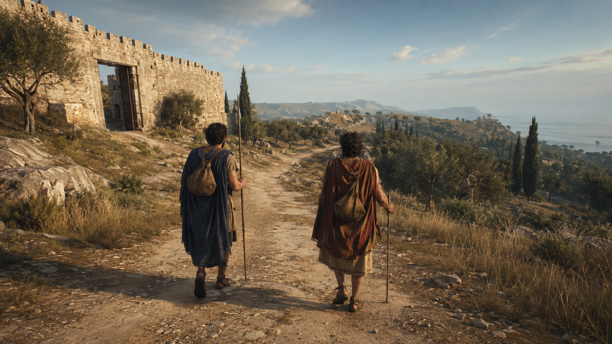
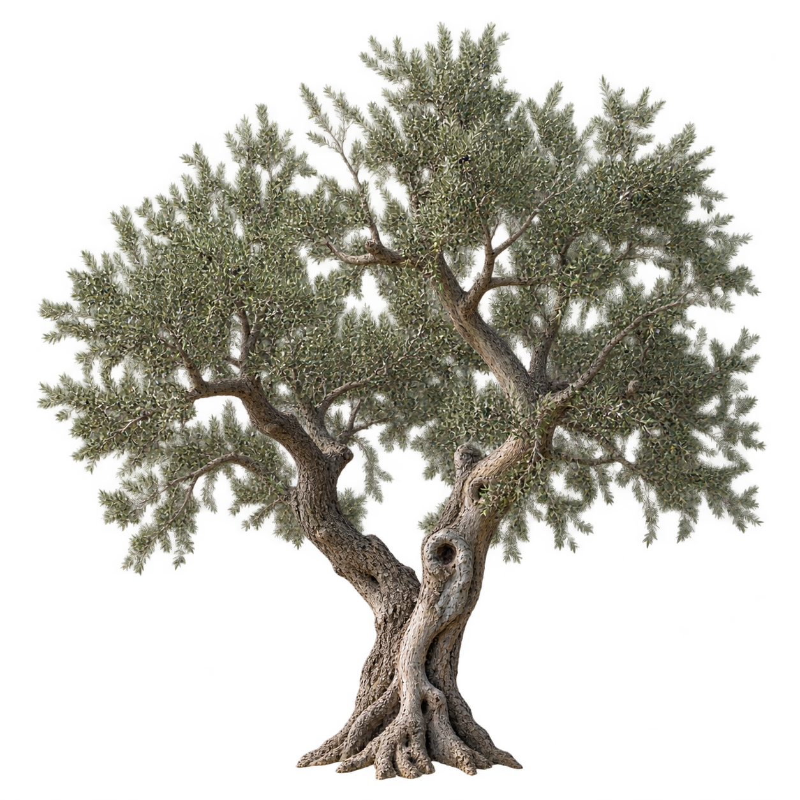

# Metaxu visual targets

## Abdera visual target v1

This image is a generated art-direction target, not a background plate and not
historical evidence. It sets the desired composition and material density for
the first playable region while the implementation remains fully navigable 3D.

### What the playable frame must reproduce

- a shoulder-height third-person camera with both travellers readable at once;
- a road that acts as a strong navigational line without becoming a corridor;
- ground at three scales: terrain shape, wheel ruts and stones, fine dust;
- worn limestone with varied blocks, damaged edges and believable roughness;
- Mediterranean vegetation built from irregular silhouettes, not primitives;
- warm low sun, cool skylight and atmospheric separation of distant hills;
- practical, travel-worn bodies and clothing instead of heroic mannequin poses.

Historical forms, clothing and construction details must be checked separately
before they become canonical. The image deliberately contains no UI so visual
comparisons are not helped by the overlay.

### Generation prompt

Use case: historical-scene. Asset type: game environment concept art and visual
target for a third-person 3D vertical slice. A photorealistic AAA-quality
third-person open-world game screenshot of two adult Greek travellers beginning
a long journey outside the eastern gate of Abdera in Thrace, circa 430 BCE, in
the lifetime of Democritus. A bounded but deep coastal landscape with a worn
limestone gate, dusty rutted road, dry grass, low shrubs, olive trees, cypress,
weathered rocks, distant Thracian hills and a restrained glimpse of the Aegean
through dawn haze. Practical wool and linen clothing, small packs, a plain spear
and a walking staff; natural proportions and grounded body language. A 16:9,
35 mm-equivalent gameplay camera about two metres behind the pair at shoulder
height. Low warm sunrise, cool sky fill, long soft-edged shadows, physically
based materials and natural filmic contrast. No modern, Roman imperial,
medieval or fantasy elements; no HUD, text, logos or watermark.

Generated with the built-in image generation tool.

## Olive tree impostor v1

This generated RGBA image is a temporary lightweight vegetation asset. The
runtime uses a WebP derivative at
`public/assets/generated/olive-tree-impostor-v1.webp` on crossed planes. It is
not a botanical or historical source and must be replaced by an authored 3D
tree with LODs before the visual target can be considered reached.

### Generation prompt

Use case: transparent-background. Asset type: game vegetation impostor. One
mature Mediterranean olive tree (`Olea europaea`), full silhouette from roots
to crown, realistic five-metre scale, split twisted pale-grey trunk, airy
asymmetric crown with small dusty silver-green leaves and natural gaps.
Photorealistic AAA environment-asset treatment, neutral diffuse daylight, true
transparent alpha background, clean anti-aliased edge, no ground, shadow,
scenery, text, border or watermark. Square canvas with transparent padding,
suitable for crossed planes.

Generated with the built-in image generation tool. The lossless source remains
in this folder; the runtime WebP was encoded at quality 88 with alpha quality
92.
